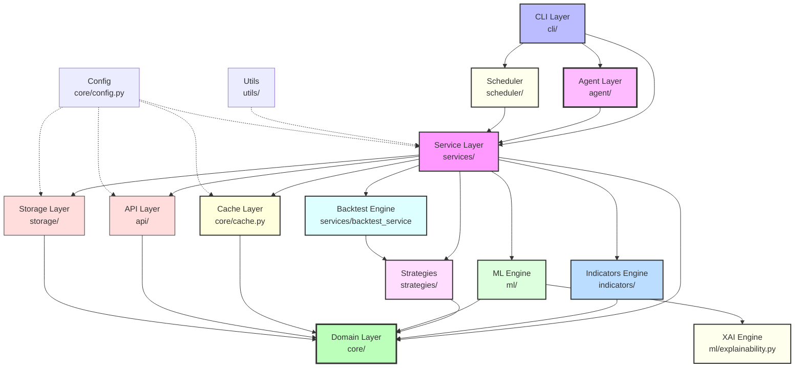

# 📈 Forex Tracker (CLI & Agent Base)

> **أداة سطر أوامر (CLI Tool) مفتوحة المصدر** مبنية وفق معمارية **Agile / Vertical Slice Architecture** لتحليل وتتبع أسواق العملات الأجنبية (Forex). تمثل الأساس المعماري لتطوير **Forex AI Agent** تفاعلي يعتمد على خوارزميات التعلم الآلي وقابلية التفسير (ML + LSTM + XAI).

<div align="center">


</div>

---

## 📑 جدول المحتويات

<details>
<summary>اضغط لعرض المحتويات</summary>

- [نظرة عامة](#-نظرة-عامة)
- [متطلبات التشغيل](#️-متطلبات-التشغيل)
- [التثبيت والإعداد](#-التثبيت-والإعداد)
- [الاستخدام وأوامر الـ CLI](#-الاستخدام-وأوامر-الـ-cli)
- [الاختبارات](#-تشغيل-اختبارات-الوحدة)
- [هيكل المشروع](#-هيكل-المشروع-الحالي)
- [المعمارية ومبادئ التصميم](#️-المعمارية-ومبادئ-التصميم)
- [Docker والنشر](#-docker-والنشر)
- [خارطة الطريق](#️-خارطة-الطريق-roadmap)
- [المساهمة](#-المساهمة)
- [الترخيص](#-الترخيص)

</details>

---

## 🎯 نظرة عامة

**Forex Tracker** ليس مجرد أداة لجلب الأسعار — بل هو **أساس معماري صلب** لبناء وكيل ذكي (AI Agent) قادر على:

- 📊 تحليل الأسواق وتتبع الشموع السعرية بدقة مالية عالية.
- 🤖 استخدام نماذج التعلم الآلي للتنبؤ بالاتجاهات.
- 🔍 تقديم تفسيرات واضحة لقرارات النماذج (Explainable AI).
- 🧠 اتخاذ قرارات تداول مبنية على **توافق إشارات متعددة** (Multi-Signal Confluence).
- 🐳 **النشر في حاويات Docker** مع مهام خلفية مجدولة (Background Tasks).

### ✨ المميزات الأساسية

| الميزة | الوصف |
| -------- | ------- |
| 🏗️ **Clean Architecture** | فصل تام بين الطبقات (Domain / Services / Agent / CLI / Storage) |
| 💰 **دقة مالية** | استخدام `Decimal` بدلاً من `float` لتجنب أخطاء التقريب |
| 🔒 **Immutable Objects** | حماية بيانات الشموع من التعديل العرضي |
| 🔌 **Adapter Pattern** | سهولة استبدال مزودي البيانات (TwelveData → أي مصدر آخر) |
| ⚡ **Bulk Ingestion** | حفظ مئات الشموع في معاملة واحدة (~300x أسرع) |
| ⏱️ **Rate Limiting** | تأخير زمني تلقائي بين الطلبات لتفادي حظر الـ API |
| 🎯 **Domain Validation** | توحيد `eurusd` → `EUR/USD` والتحقق قبل استهلاك الشبكة |
| 📐 **Technical Indicators Engine** | محرك تحليلي نقي لحساب SMA, EMA, RSI, و MACD بدون مكتبات خارجية ثقيلة |
| 🔔 **Alert Engine** | نظام تنبيهات ذكي للسعر والمؤشرات مع كشف تكرار تلقائي |
| 🗄️ **Cache Layer** | نظام كاش مزدوج (Memory / Redis) مع Cache-Aside و Fallback تلقائي |
| 📊 **Backtesting Engine** | محاكي استراتيجيات تاريخي مع مقاييس أداء كاملة (Win Rate, ROI, Max Drawdown, Profit Factor) |
| 🤖 **ML Forecasting** | تنبؤات احتمالية باتجاه السعر باستخدام Logistic Regression مع Time-Series Split (بدون تسريب بيانات) |
| 🔍 **XAI (Explainable AI)** | تفسير كل قرار تنبؤ: أي المؤشرات دفعت الصعود/الهبوط، بأي قوة، ولماذا |
| 🧠 **AI Agent** | وكيل ذكي يدمج المؤشرات + ML + XAI لتوليد توصية تداول مع درجة ثقة وسرد تفسيري |
| 🐳 **Docker & Scheduler** | حاويات نشر + مهام خلفية مجدولة (Alerts + Forecasts) تلقائياً |
| 🧪 **Testable** | Dependency Injection وعزل كامل للاختبارات |
| 📝 **Logging شامل** | تسجيل دائم في ملفات + عرض على الطرفية |

---

## 📚 توثيق الـ Sprints المكتملة

للاطلاع على التفاصيل المعمارية الكاملة لكل Sprint:

| Sprint | الحالة | الإصدار | التوثيق |
| -------- | -------- | --------- | --------- |
| **Sprint 0 — Foundation** | ✅ مكتمل | `v0.1.0` | [📄 عرض التوثيق](docs/sprint-0.md) |
| **Sprint 1 — PRICE (MVP)** | ✅ مكتمل | `v0.1.0` | [📄 عرض التوثيق](docs/sprint-1.md) |
| **Sprint 2 — Multi-Pairs & Intervals** | ✅ مكتمل | `v0.2.0` | [📄 عرض التوثيق](docs/sprint-2.md) |
| **Sprint 3 — Technical Indicators** | ✅ مكتمل | `v0.3.0` | [📄 عرض التوثيق](docs/sprint-3.md) |
| **Sprint 4 — Alerts & Triggers** | ✅ مكتمل | `v0.4.0` | [📄 عرض التوثيق](docs/sprint-4.md) |
| **Sprint 5 — Caching & Performance** | ✅ مكتمل | `v0.5.0` | [📄 عرض التوثيق](docs/sprint-5.md) |
| **Sprint 6 — Strategy Backtesting** | ✅ مكتمل | `v0.6.0` | [📄 عرض التوثيق](docs/sprint-6.md) |
| **Sprint 7 — ML Forecasting** | ✅ مكتمل | `v0.7.0` | [📄 عرض التوثيق](docs/sprint-7.md) |
| **Sprint 8 — Explainable AI (XAI)** | ✅ مكتمل | `v0.8.0` | [📄 عرض التوثيق](docs/sprint-8.md) |
| **Sprint 9 — Forex AI Agent** | ✅ مكتمل | `v0.9.0` | [📄 عرض التوثيق](docs/sprint-9.md) |
| **Sprint 11** - Risk Management** | ✅ مكتمل | `v1.0.0` | [📄 عرض التوثيق](docs/sprint-10.md) |

> 💡 كل ملف توثيق يحتوي على: المكونات، الأنماط المعمارية، مخططات التدفق، وقرارات التصميم.

---

## 🛠️ متطلبات التشغيل

<table>
<tr>
<th>المتطلب</th>
<th>الإصدار</th>
<th>ملاحظات</th>
</tr>
<tr>
<td><b>Python</b></td>
<td>3.12+</td>
<td>مطلوب لدعم Type Hints الحديثة و <code>match</code> statements</td>
</tr>
<tr>
<td><b>نظام التشغيل</b></td>
<td>Linux / WSL Ubuntu / macOS / Windows</td>
<td>جميع الأنظمة مدعومة</td>
</tr>
<tr>
<td><b>أدوات إضافية</b></td>
<td><code>pip</code>, <code>venv</code></td>
<td>مدمجة مع Python 3.12</td>
</tr>
<tr>
<td><b>مكتبة ML</b></td>
<td><code>scikit-learn</code></td>
<td>مطلوبة للتنبؤات (<code>pip install scikit-learn</code>)</td>
</tr>
<tr>
<td><b>Docker</b></td>
<td>24.0+</td>
<td>للنشر في حاويات</td>
</tr>
<tr>
<td><b>Docker Compose</b></td>
<td>2.20+</td>
<td>لتشغيل الخدمات المتعددة</td>
</tr>
<tr>
<td><b>اختياري</b></td>
<td><code>redis</code></td>
<td>للـ RedisCache (<code>pip install redis</code>) — بدونها يعمل <code>MemoryCache</code></td>
</tr>
</table>

---

## 📦 التثبيت والإعداد

### 1️⃣ استنساخ المستودع

```bash
git clone <repository-url>
cd forex_tracker
```

### 2️⃣ إنشاء وتفعيل البيئة الافتراضية

**إنشاء البيئة:**

```bash
python3 -m venv venv
```

**تفعيل البيئة حسب نظام التشغيل:**

| النظام | الأمر |
| -------- | ------- |
| **Linux / macOS / WSL** | `source venv/bin/activate` |
| **Windows (PowerShell)** | `.\venv\Scripts\Activate.ps1` |
| **Windows (CMD)** | `venv\Scripts\activate.bat` |

### 3️⃣ تثبيت الحزمة

```bash
pip install -e .
```

> 💡 **ملاحظة**: خيار `-e` (Editable Mode) يتيح تعديل الكود واختباره **فوراً** عبر أمر `forex` دون الحاجة لإعادة التثبيت.

### 4️⃣ تثبيت مكتبة التنبؤ (Sprint 7)

```bash
pip install scikit-learn
```

### 5️⃣ إعداد متغيرات البيئة

أنشئ ملف `.env` في جذر المشروع:

```env
TWELVEDATA_API_KEY=your_api_key_here
CACHE_BACKEND=memory
REDIS_URL=redis://localhost:6379/0
LOG_LEVEL=INFO
```

> 💡 **ملاحظة**: يمكنك نسخ `.env.example` → `.env` وتعديل القيم.

---

## 💻 الاستخدام وأوامر الـ CLI

### 📋 عرض قائمة المساعدة

```bash
forex --help
```

### 💵 جلب السعر اللحظي الفوري

```bash
forex price --pair EUR/USD
```

**المخرجات المتوقعة:**

```
💵 EUR/USD Current Price: 1.0842
```

### 📥 جلب الشموع — زوج واحد

```bash
forex fetch --pair EUR/USD --interval 1h --limit 5
```

**المخرجات المتوقعة:**

```
✅ Successfully fetched and stored 5 candle(s) for EUR/USD [1h]:
  • 2026-10-10 14:00:00 | Close: 1.0842 | High: 1.0865 | Low: 1.0803
  • 2026-10-10 13:00:00 | Close: 1.0838 | High: 1.0855 | Low: 1.0798
  ...
```

### 📥 جلب الشموع — عدة أزواج (Batch)

```bash
forex fetch --pairs EUR/USD,GBP/USD,USD/JPY --interval 1day --limit 2
```

**المخرجات المتوقعة:**

```
⏳ Fetching batch data for 3 pairs [1day]...

--- Batch Ingestion Results ---
  • EUR/USD    : ✅ 2 candles
  • GBP/USD    : ✅ 2 candles
  • USD/JPY    : ✅ 2 candles
```

### 📊 استعراض الشموع المخزنة (بإطار محدد)

```bash
forex list --pair EUR/USD --interval 1h --limit 10
```

**المخرجات المتوقعة:**

```
--- Stored Candles: EUR/USD [1h] (Last 5) ---
Date / Time          | Open       | High       | Low        | Close      | Volume
------------------------------------------------------------------------------------
2026-10-10 14:00     | 1.0817     | 1.0865     | 1.0803     | 1.0842     | 125432
2026-10-10 13:00     | 1.0805     | 1.0855     | 1.0798     | 1.0838     | 98321
...
```

### 👁️ قائمة المراقبة الحية (Watchlist)

```bash
forex watchlist --pairs EUR/USD,GBP/USD,USD/JPY
```

**المخرجات المتوقعة:**

```
⏳ Loading live quotes for: EUR/USD, GBP/USD, USD/JPY...

--- Live Forex Watchlist ---
Pair       | Current / Close | High         | Low          | Time (UTC)
--------------------------------------------------------------------------
EUR/USD    | 1.0842          | 1.0865       | 1.0803       | 2026-10-10 14:30
GBP/USD    | 1.2515          | 1.2548       | 1.2492       | 2026-10-10 14:30
USD/JPY    | 149.32          | 149.85       | 148.95       | 2026-10-10 14:30
```

### 📈 التحليل الفني والمؤشرات (Technical Analysis)

```bash
forex analyze --pair EUR/USD --interval 1day --limit 35
```

**المخرجات المتوقعة:**

```
========================================================
 📊 Technical Analysis: EUR/USD [1day] (Evaluated: 35 candles)
========================================================
• Latest Close : 1.0842 (at 2026-10-10 14:00)
• RSI (14)     : 58.42 -> Neutral
• MACD (12,26) : 0.00142 | Signal (9): 0.00098 | Hist: 0.00044 -> 🟢 Bullish Momentum (زخم صاعد)
• SMA (20)     : 1.0795 -> Above SMA (اتجاه صاعد قصير المدى)

--- Recent Candles Matrix (Last 5) ---
Timestamp         | Close      | SMA(20)    | RSI(14)    | MACD (Hist)       
---------------------------------------------------------------------------
2026-10-10 10:00  | 1.0815     | 1.0782     | 54.12      | 0.00031           
2026-10-10 11:00  | 1.0822     | 1.0786     | 55.40      | 0.00035           
2026-10-10 12:00  | 1.0830     | 1.0789     | 56.81      | 0.00039           
2026-10-10 13:00  | 1.0838     | 1.0792     | 57.95      | 0.00041           
2026-10-10 14:00  | 1.0842     | 1.0795     | 58.42      | 0.00044           
```

### 🔮 التنبؤ بالذكاء الاصطناعي (ML Forecasting)

```bash
forex forecast --pair EUR/USD --interval 1day --limit 150
```

**المخرجات المتوقعة:**

```
⏳ Training model and generating forecast for EUR/USD [1day]...

========================================================
 🔮 ML Forecast: EUR/USD [1day]
========================================================
Model         : LogisticRegression
Last Candle   : 2026-10-10 00:00 (Close: 1.0842)

--- Prediction ---
Direction     : 🟢 UP
Up Probability: 62.50%
Down Probability: 37.50%

--- Model Performance ---
Test Accuracy : 58.33%
Train Samples : 96
Test Samples  : 24
========================================================
```

### 🔍 التنبؤ مع التفسير (XAI — Explainable AI)

```bash
forex forecast --pair EUR/USD --interval 1day --limit 150 --explain
```

**المخرجات المتوقعة:**

```
⏳ Training model and generating forecast for EUR/USD [1day]...

========================================================
 🔮 ML Forecast: EUR/USD [1day]
========================================================
Model         : LogisticRegression
Last Candle   : 2026-10-10 00:00 (Close: 1.0842)

--- Prediction ---
Direction     : 🟢 UP
Up Probability: 62.50%
Down Probability: 37.50%

--- Model Performance ---
Test Accuracy : 58.33%
Train Samples : 96
Test Samples  : 24

--- 🧠 XAI Explanation (Why this prediction?) ---
🟢 Top Bullish Drivers:
  1. RSI (Normalized)  : +0.5850  (Weight: 0.90)
  2. Price Return      : +0.0045  (Weight: 1.50)
  3. MACD              : +0.0024  (Weight: 1.20)

🔴 Top Bearish Drags:
  1. SMA Distance      : -0.0120  (Weight: -0.80)
  2. Candle Range      : -0.0008  (Weight: -0.20)

📊 Global Feature Importance (Overall Model Weights):
  1. Price Return      : 1.50
  2. MACD              : 1.20
  3. RSI (Normalized)  : 0.90
  4. SMA Distance      : 0.80
  5. Candle Range      : 0.20
========================================================
```

### 🤖 الوكيل الذكي — تحليل السوق والتوصية (AI Agent)

```bash
forex agent analyze --pair EUR/USD --interval 1day --limit 120
```

**المخرجات المتوقعة:**

```
⏳ Agent is analyzing market data for EUR/USD [1day]...

========================================================
 🤖 Forex AI Agent — Market Analysis
========================================================
Pair          : EUR/USD [1day]
Current Price : 1.0842
Market Regime : Bullish Expansion

📊 Technical Bias : BULLISH
🤖 ML Bias        : UP

💡 Recommended Action : 🟢 BUY (Confidence: 82%)

--- Key Reasons ---
  1. Price (1.08420) is trading above 20-period SMA (1.07950).
  2. RSI shows positive momentum at 58.4.
  3. MACD Histogram is positive (+0.00044).
  4. ML Model predicts UP direction with 62.5% probability.
  5. Top XAI Driver: RSI (Normalized) is supporting upward movement.

--- Narrative ---
Market for EUR/USD is currently in a Bullish Expansion.
Technical indicators lean bullish, while the predictive ML
model signals UP. Given the confluence of signals, the
recommended tactical posture is to BUY with 82% confidence.
========================================================
```

#### حالة WAIT — مثال على إشارات مختلطة

```bash
forex agent analyze --pair GBP/USD --interval 4h
```

**المخرجات المتوقعة:**

```
========================================================
 🤖 Forex AI Agent — Market Analysis
========================================================
Pair          : GBP/USD [4h]
Current Price : 1.2515
Market Regime : Consolidation / Mixed Signals

📊 Technical Bias : NEUTRAL
🤖 ML Bias        : DOWN

💡 Recommended Action : ⏸️ WAIT (Confidence: 50%)

--- Key Reasons ---
  1. Price (1.25150) is trading above 20-period SMA (1.24800).
  2. RSI shows weak momentum at 45.2.
  3. MACD Histogram is negative (-0.00012).
  4. ML Model probability is neutral (52.1% UP).

--- Narrative ---
Market for GBP/USD is currently in a Consolidation / Mixed Signals.
Technical indicators lean neutral, while the predictive ML model
signals DOWN. Given the confluence of signals, the recommended
tactical posture is to WAIT with 50% confidence.
========================================================
```

> 💡 **ملاحظة**: الوكيل يُرجع **WAIT** عندما تكون الإشارات مختلطة أو غير كافية — الانتظار قرار استثماري محوري.

### 🔔 إدارة التنبيهات (Alerts)

#### إضافة تنبيه سعري

```bash
forex alert add --pair EUR/USD --condition "price > 1.0500" --message "EUR Breakout Target"
```

**المخرجات المتوقعة:**

```
✅ Alert created successfully!
  • ID        : a1b2c3d4
  • Pair      : EUR/USD [1day]
  • Condition : price > 1.0500
  • Status    : ACTIVE
  • Message   : EUR Breakout Target
```

#### إضافة تنبيه لمؤشر فني (RSI)

```bash
forex alert add --pair EUR/USD --condition "rsi < 35" --message "EUR Oversold Alert"
```

#### عرض التنبيهات المسجلة

```bash
forex alert list
forex alert list --active
```

**المخرجات المتوقعة:**

```
--- All Alerts History (2) ---
ID         | Pair       | Timeframe | Condition            | Status       | Created At          
------------------------------------------------------------------------------------------
a1b2c3d4   | EUR/USD    | 1day      | price > 1.0500       | 🟢 ACTIVE    | 2026-10-10 14:30    
e5f6g7h8   | EUR/USD    | 1day      | rsi < 35             | 🟢 ACTIVE    | 2026-10-10 14:31    
```

#### فحص التنبيهات النشطة

```bash
forex alert check
forex alert check --pair EUR/USD
```

**المخرجات المتوقعة (عند تحقق شرط):**

```
🔍 Checking active alerts against latest market data...

🚨 1 Alert(s) Triggered!
============================================================
🔔 [a1b2c3d4] EUR/USD (1day)
   Condition : price > 1.0500
   Actual    : 1.0842
   Message   : EUR Breakout Target
   Triggered : 2026-10-10 14:35:12
------------------------------------------------------------
```

#### حذف تنبيه

```bash
forex alert delete --id a1b2c3d4
```

**المخرجات المتوقعة:**

```
🗑️  Alert 'a1b2c3d4' deleted successfully.
```

### 📊 اختبار الاستراتيجيات التاريخي (Backtesting)

```bash
forex backtest --pair EUR/USD --interval 1day --limit 100 --fast 10 --slow 30
```

**المخرجات المتوقعة:**

```
⏳ Running backtest for EUR/USD [1day] using SMA_Crossover(10/30)...

========================================================
 📊 Backtest Report: EUR/USD [1day]
========================================================
Strategy      : SMA_Crossover(10/30)
Initial Capital: $10,000.00
Final Capital  : $10,850.50
Total PnL     : $+850.50
ROI           : +8.51%

--- Performance Metrics ---
Total Trades  : 8
Winning       : 5 (62.5%)
Losing        : 3 (37.5%)
Win Rate      : 62.5%
Max Drawdown  : 4.20%
Profit Factor : 2.15

--- Recent Trades (Last 3) ---
Entry Time          | Entry      | Exit       | PnL        | Status
-----------------------------------------------------------------------
2026-09-15 00:00    | 1.0720     | 1.0850     | +0.0130    | ✅ WIN
2026-09-20 00:00    | 1.0890     | 1.0810     | -0.0080    | ❌ LOSS
2026-10-01 00:00    | 1.0760     | 1.0920     | +0.0160    | ✅ WIN
```

#### إعدادات متقدمة

```bash
# رأس مال مختلف وحجم صفقة مخصص
forex backtest --pair GBP/USD --interval 4h --limit 200 \
               --capital 50000 --size 25000 --fast 5 --slow 20
```

### 🗄️ إدارة الكاش (Cache)

#### عرض حالة النظام وإحصائيات الكاش

```bash
forex status
```

**المخرجات المتوقعة:**

```
--- Forex Tracker Status ---
App Name     : Forex Tracker
Version      : 1.0.0
Data Dir     : ./data
Log File     : ./logs/app.log
Status       : Ready

--- Cache Performance ---
Backend      : MEMORY
Hits         : 1
Misses       : 1
Items Cached : 1
```

#### تفريغ الكاش

```bash
forex cache clear
```

**المخرجات المتوقعة:**

```
🧹 Cache has been successfully cleared.
```

### ⚙️ المهام الخلفية المجدولة (Background Scheduler)

#### تشغيل الـ Scheduler يدوياً

```bash
forex scheduler run --interval 300
```

**المخرجات المتوقعة:**

```
⏳ Starting background scheduler (every 300s)...
[2026-10-10 14:35:00] ✓ Checked 2 alerts. Triggered: 0
[2026-10-10 14:40:00] ✓ Checked 2 alerts. Triggered: 1
[2026-10-10 14:45:00] ✓ Forecast for EUR/USD: UP (62.5%)
...
^C
⏹️ Scheduler stopped gracefully.
```

#### تشغيل دورة واحدة (One-shot)

```bash
forex scheduler run --once
```

> 💡 **ملاحظة**: `--once` مفيد في **cron jobs** — يُنفّذ دورة واحدة ثم يخرج.

### 📋 ملخص الأوامر

| الأمر | الوصف | مثال |
| ------- | ------- | ------ |
| `price` | سعر لحظي | `forex price --pair EUR/USD` |
| `fetch` | جلب + حفظ (زوج أو عدة) | `forex fetch --pairs A,B --interval 1h` |
| `list` | استعراض السجل | `forex list --pair EUR/USD --interval 1h` |
| `watchlist` | مقارنة لحظية | `forex watchlist --pairs A,B,C` |
| `analyze` | تحليل فني ومؤشرات | `forex analyze --pair EUR/USD --interval 1day` |
| **`forecast`** | **تنبؤ ML باتجاه السعر** | **`forex forecast --pair EUR/USD`** |
| **`forecast --explain`** | **تنبؤ + تفسير XAI** | **`forex forecast --pair EUR/USD --explain`** |
| **`agent analyze`** | **تحليل ذكي + توصية (AI Agent)** | **`forex agent analyze --pair EUR/USD`** |
| `alert add` | إضافة تنبيه | `forex alert add --pair EUR/USD --condition "price > 1.09"` |
| `alert list` | عرض التنبيهات | `forex alert list --active` |
| `alert check` | فحص التنبيهات | `forex alert check` |
| `alert delete` | حذف تنبيه | `forex alert delete --id abc12345` |
| `backtest` | اختبار استراتيجية | `forex backtest --pair EUR/USD --fast 10 --slow 30` |
| **`scheduler run`** | **تشغيل المهام الخلفية** | **`forex scheduler run --interval 300`** |
| `cache clear` | تفريغ الكاش | `forex cache clear` |
| `status` | حالة النظام + الكاش | `forex status` |
| `version` | الإصدار | `forex version` |

---

## 🐳 Docker والنشر

### البنية

```
┌─────────────────────────────────────────┐
│  Docker Compose                          │
│                                          │
│  ┌──────────┐    ┌──────────┐    ┌──────┐│
│  │  forex   │    │scheduler │    │redis ││
│  │  (CLI)   │    │(worker)  │    │      ││
│  └────┬─────┘    └────┬─────┘    └──┬───┘│
│       │               │              │   │
│       └───────────────┴──────────────┘   │
│                shared volume             │
│              ./data/candles.db            │
└─────────────────────────────────────────┘
```

### 1️⃣ بناء صورة Docker

```bash
docker build -t forex-tracker:latest .
```

### 2️⃣ تشغيل CLI عبر Docker

```bash
docker run --rm -it \
  -v $(pwd)/data:/app/data \
  -v $(pwd)/logs:/app/logs \
  -e TWELVEDATA_API_KEY=your_key \
  forex-tracker:latest price --pair EUR/USD
```

### 3️⃣ تشغيل عبر Docker Compose

```bash
docker compose up -d
```

**الخدمات:**

| الخدمة | الوصف | المنفذ |
| -------- | ------- | -------- |
| **forex-cli** | حاوية CLI تفاعلية | — |
| **scheduler** | مهام خلفية (alerts + forecasts) | — |
| **redis** | كاش Redis اختياري | `6379` |

### 4️⃣ تشغيل المهام الخلفية

```bash
docker compose logs -f scheduler
```

**المخرجات المتوقعة:**

```
scheduler-1  | [2026-10-10 14:35:00] ✓ Checked 2 alerts. Triggered: 0
scheduler-1  | [2026-10-10 14:40:00] ✓ Forecast for EUR/USD: UP (62.5%)
```

### 5️⃣ إيقاف الخدمات

```bash
docker compose down
```

> 💡 **ملاحظة**: `docker-compose.yml` يحتوي على **health checks** لكل خدمة، و**restart policy** (`unless-stopped`) لضمان استمرارية التشغيل.

---

## 🧪 تشغيل اختبارات الوحدة

```bash
python -m unittest discover tests
```

**النتيجة المتوقعة:**

```
....................................................
----------------------------------------------------------------------
Ran 68 tests in 0.8xxs

OK
```

### 🎯 ما الذي تغطيه الاختبارات؟

| الملف | التغطية | Sprint |
| ------- | --------- | -------- |
| `test_foundation.py` | Config Singleton + Storage + Timer Decorator | 0 |
| `test_price_mvp.py` | Candle Validation + HTTP Client + TwelveData Adapter + SQLite CRUD | 1 |
| `test_multi_pairs.py` | CurrencyPair + Interval + Bulk Ingest + Watchlist + Throttling | 2 |
| `test_indicators.py` | SMA + EMA + RSI (Wilder's Smoothing) + MACD Engine & Relations | 3 |
| `test_alerts.py` | AlertCondition Parse/Evaluate + Alert CRUD + Trigger Idempotency | 4 |
| `test_cache.py` | MemoryCache TTL + RedisCache Fallback + Cache-Aside Pattern | 5 |
| `test_backtest.py` | Trade PnL + SMA Crossover Signals + Backtest Metrics (ROI, Drawdown, PF) | 6 |
| `test_forecast.py` | FeatureExtractor + LogisticForecaster Training + Prediction + Time-Series Split | 7 |
| `test_xai.py` | Feature Weights + PredictionExplainer + Bullish/Bearish Split + Global Importance | 8 |
| `test_agent.py` | ForexAgent Orchestration + Signal Confluence + Action Recommendation + Confidence | 9 |
| `test_scheduler.py` | Scheduler Loop + One-shot Mode + Graceful Shutdown + Task Execution | 10 |

---

## 📂 هيكل المشروع الحالي

```
forex_tracker/
│
├── config.json              # ملف الإعدادات الأساسي (يشمل cache + scheduler)
├── pyproject.toml           # إعدادات الحزمة وربط أمر forex
├── README.md                # توثيق المشروع
├── main.py                  # نقطة الدخول البديلة للتشغيل المباشر
├── Dockerfile               # صورة Docker للحزمة
├── docker-compose.yml       # تنسيق الخدمات (CLI + Scheduler + Redis)
├── .env.example             # نموذج متغيرات البيئة
├── .dockerignore            # استثناءات Docker
│
├── agent/                   # الوكيل الذكي (AI Agent)
│   ├── __init__.py
│   └── market_agent.py      # ForexAgent: دمج المؤشرات + ML + XAI لتوصية
│
├── api/                     # طبقة الاتصال الخارجي والشبكة
│   ├── __init__.py
│   ├── client.py            # عميل HTTP الموحد ومعالجة الـ Timeout
│   └── sources/             # محولات مصادر البيانات (Adapters)
│       ├── __init__.py
│       └── twelvedata.py    # محول واجهة TwelveData API
│
├── cli/                     # طبقة سطر الأوامر
│   ├── __init__.py
│   ├── parser.py            # معالجة المدخلات ونقطة تشغيل CLI
│   └── commands.py          # دوال تنفيذ الأوامر (price, fetch, alert, backtest, forecast, agent, scheduler...)
│
├── core/                    # النواة الأساسية ومنطق الـ Domain
│   ├── __init__.py
│   ├── candle.py            # نموذج الشمعة السعرية (Immutable Value Object)
│   ├── pair.py              # كائن التحقق وتوحيد أزواج العملات
│   ├── intervals.py         # الأطر الزمنية القياسية (Enum)
│   ├── alert.py             # كائن التنبيه والشرط (Alert, AlertCondition, AlertStatus)
│   ├── cache.py             # نظام الكاش (BaseCache + MemoryCache + RedisCache + get_cache)
│   ├── trade.py             # كائنات الصفقات والإشارات (Trade, SignalType, TradeStatus)
│   ├── strategy.py          # العقد التجريدي للاستراتيجيات (BaseStrategy)
│   ├── config.py            # مدير الإعدادات (Singleton)
│   ├── exceptions.py        # التسلسل الهرمي للأخطاء
│   └── logger.py            # نظام السجلات
│
├── docs/                    # توثيق مراحل التطوير
│   ├── sprint-0.md
│   ├── sprint-1.md
│   ├── sprint-2.md
│   ├── sprint-3.md
│   ├── sprint-4.md
│   ├── sprint-5.md
│   ├── sprint-6.md
│   ├── sprint-7.md
│   ├── sprint-8.md
│   ├── sprint-9.md
│   └── sprint-10.md
│
├── indicators/              # محرك المؤشرات الفنية (Domain Engine)
│   ├── __init__.py
│   ├── base.py              # العقد التجريدي وكائنات النتائج (BaseIndicator)
│   ├── moving_averages.py   # حساب SMA و EMA بدقة Decimal
│   └── momentum.py          # مؤشرات الزخم والاتجاه (RSI & MACD)
│
├── ml/                      # طبقة التعلم الآلي (Machine Learning)
│   ├── __init__.py
│   ├── features.py          # هندسة واستخراج الميزات الفنية (FeatureExtractor)
│   ├── explainability.py    # محرك تفسير القرارات (PredictionExplainer - XAI)
│   └── models/              # نماذج التنبؤ
│       ├── __init__.py
│       ├── base.py          # العقد التجريدي (BaseForecaster)
│       └── logistic.py      # نموذج Logistic Regression (LogisticForecaster)
│
├── scheduler/               # المهام الخلفية المجدولة (Background Scheduler)
│   ├── __init__.py
│   └── task_runner.py       # TaskRunner: حلقة مهام دورية + one-shot mode
│
├── strategies/              # استراتيجيات التداول
│   ├── __init__.py
│   └── sma_crossover.py     # استراتيجية تقاطع SMA (Golden/Death Cross)
│
├── services/                # طبقة تنسيق الأعمال (Business Logic)
│   ├── __init__.py
│   ├── forex_service.py     # منسق العمليات (single/multi-pair + indicators + cache)
│   ├── alert_service.py     # منسق إدارة وتقييم التنبيهات (Alert Engine)
│   ├── backtest_service.py  # محرك المحاكاة التاريخية وحساب المقاييس
│   └── forecast_service.py  # خدمة التنبؤ بالذكاء الاصطناعي (ML + XAI Orchestrator)
│
├── storage/                 # طبقة التخزين الدائم
│   ├── __init__.py
│   ├── base.py              # العقد الأساسي للتخزين (Storage ABC)
│   ├── memory_storage.py    # تخزين في الذاكرة للاختبارات
│   └── sqlite_storage.py    # محرك التخزين الدائم بـ SQLite (Bulk + interval + alerts)
│
├── utils/                   # أدوات مساعدة
│   ├── __init__.py
│   └── decorators.py        # ديكوريتور قياس الأداء (@timer)
│
├── data/                    # مجلد قاعدة البيانات المحلية
│   └── candles.db
├── logs/                    # مجلد سجلات التطبيق
│   └── app.log
└── tests/                   # اختبارات الوحدة المؤتمتة
    ├── __init__.py
    ├── test_foundation.py   # اختبارات Sprint 0
    ├── test_price_mvp.py    # اختبارات Sprint 1
    ├── test_multi_pairs.py  # اختبارات Sprint 2
    ├── test_indicators.py   # اختبارات Sprint 3
    ├── test_alerts.py       # اختبارات Sprint 4
    ├── test_cache.py        # اختبارات Sprint 5
    ├── test_backtest.py     # اختبارات Sprint 6
    ├── test_forecast.py     # اختبارات Sprint 7
    ├── test_xai.py          # اختبارات Sprint 8
    ├── test_agent.py        # اختبارات Sprint 9
    └── test_scheduler.py    # اختبارات Sprint 10
```

### 🗂️ الطبقات المعمارية


```mermaid
graph TD
    A[CLI Layer<br/>cli/] --> B[Service Layer<br/>services/]
    A --> P[Agent Layer<br/>agent/]
    A --> S[Scheduler<br/>scheduler/]
    
    P --> B
    S --> B
    
    B --> C[API Layer<br/>api/]
    B --> D[Storage Layer<br/>storage/]
    B --> H[Indicators Engine<br/>indicators/]
    B --> K[Backtest Engine<br/>services/backtest_service]
    B --> L[Strategies<br/>strategies/]
    B --> M[ML Engine<br/>ml/]
    B --> J[Cache Layer<br/>core/cache.py]
    B --> E[Domain Layer<br/>core/]
    
    K --> L
    M --> N[XAI Engine<br/>ml/explainability.py]
    
    H --> E
    L --> E
    M --> E
    J --> E
    C --> E
    D --> E
    
    F[Utils<br/>utils/] -.-> B
    G[Config<br/>core/config.py] -.-> C
    G -.-> D
    G -.-> J
    G -.-> B

    style A fill:#bbf,stroke:#333,stroke-width:2px
    style P fill:#fbf,stroke:#333,stroke-width:3px
    style S fill:#ffe,stroke:#333,stroke-width:2px
    style B fill:#f9f,stroke:#333,stroke-width:2px
    style E fill:#bfb,stroke:#333,stroke-width:3px
    style H fill:#bdf,stroke:#333,stroke-width:2px
    style K fill:#dff,stroke:#333,stroke-width:2px
    style L fill:#fdf,stroke:#333,stroke-width:2px
    style M fill:#dfd,stroke:#333,stroke-width:2px
    style N fill:#ffe,stroke:#333,stroke-width:2px
    style J fill:#ffd,stroke:#333,stroke-width:2px
    style C fill:#fdd,stroke:#333
    style D fill:#fdd,stroke:#333
```

#### 🔄 اتجاه الاعتماد (Dependency Direction)

> **القاعدة الذهبية**: الاعتماد يتدفق **للداخل فقط**:
>
> `CLI / Scheduler → Agent → Services → Domain`
>
> **لا عكس أبداً.** `Domain` لا يعرف من يستخدمه.

| الطبقة | المسؤولية | تعتمد على |
| -------- | ----------- | ----------- |
| **CLI** | تحليل المدخلات → Dispatch | Agent / Services / Scheduler |
| **Scheduler** | تشغيل دوري للمهام | Services |
| **Agent** | قرارات عليا — يجمع Services | Services |
| **Services** | تنسيق — يجمع API / DB / ML | Domain + Infrastructure |
| **Domain** | حقائق — `Candle`, `Trade`, `Alert`, `Pair` | لا شيء (مستقل) |
| **Infrastructure** | API, DB, Cache, ML — تفاصيل قابلة للاستبدال | Domain |

---

## 🏗️ المعمارية ومبادئ التصميم

<table>
<tr>
<th width="25%">المبدأ</th>
<th width="75%">التطبيق في المشروع</th>
</tr>
<tr>
<td><b>Clean Architecture</b></td>
<td>فصل طبقات النواة (Domain) والخدمات (Services) والوكيل (Agent) والـ Scheduler عن واجهات الـ CLI وقواعد البيانات.</td>
</tr>
<tr>
<td><b>Immutable Value Objects</b></td>
<td>حماية بيانات الشموع والنتائج من التعديل العرضي وحسابات دقيقة بـ <code>Decimal</code>.</td>
</tr>
<tr>
<td><b>Adapter Pattern</b></td>
<td>فصل كود مزودي الأسعار الخارجيين عن باقي أجزاء التطبيق لتسهيل استبدالهم لاحقاً.</td>
</tr>
<tr>
<td><b>Dependency Injection</b></td>
<td>تمرير مصادر البيانات ومحركات التخزين والكاش والنماذج والخدمات للوكيل والـ Scheduler لتسهيل عزل الاختبارات.</td>
</tr>
<tr>
<td><b>Composite Key & Idempotency</b></td>
<td><code>UNIQUE(pair, interval, timestamp)</code> مع <code>ON CONFLICT REPLACE</code> لمنع التداخل والتكرار.</td>
</tr>
<tr>
<td><b>Bulk Ingestion</b></td>
<td><code>executemany</code> ضمن معاملة واحدة — أسرع ~300x من الحفظ الفردي.</td>
</tr>
<tr>
<td><b>Rate Limiting / Throttling</b></td>
<td>تأخير زمني بين الطلبات لتفادي <code>429 Too Many Requests</code> وحظر الحساب.</td>
</tr>
<tr>
<td><b>Fail Early / Fail Soft</b></td>
<td>تحقق صارم من المدخلات قبل الشبكة + تخطي الشموع/الأزواج التالفة دون إسقاط العملية كاملة.</td>
</tr>
<tr>
<td><b>Financial Standards</b></td>
<td>Wilder's Smoothing في RSI + Seed EMA بـ SMA + <code>Decimal</code> في كل خطوة حسابية.</td>
</tr>
<tr>
<td><b>Alert Idempotency</b></td>
<td>تحديث حالة التنبيه إلى <code>TRIGGERED</code> في التخزين فوراً لمنع الإطلاق المتكرر.</td>
</tr>
<tr>
<td><b>Cache-Aside Pattern</b></td>
<td>فحص الكاش أولاً (Hit) ثم الـ API (Miss) ثم الحفظ مع TTL لحماية حصة الـ API.</td>
</tr>
<tr>
<td><b>Graceful Degradation</b></td>
<td>Fallback تلقائي من Redis إلى MemoryCache عند فشل الاتصال — Zero Downtime.</td>
</tr>
<tr>
<td><b>Lookahead Prevention</b></td>
<td>الاستراتيجية ترى <code>candles[:index+1]</code> فقط — لا بيانات مستقبلية. وفي ML: <code>next_c</code> للتدريب فقط.</td>
</tr>
<tr>
<td><b>Sequential Simulation</b></td>
<td>Backtest يمر زمنياً على الشموع مع state machine للصفقات المفتوحة/المغلقة.</td>
</tr>
<tr>
<td><b>Time-Series Split</b></td>
<td>تقسيم ML زمنياً (80/20) بدون Shuffle — Train على الماضي، Test على المستقبل.</td>
</tr>
<tr>
<td><b>Probability-Based Prediction</b></td>
<td>النموذج يُرجع <code>P(Up)</code> (0-1) قبل <code>predict()</code> — يسمح بـ thresholds مخصصة.</td>
</tr>
<tr>
<td><b>Training-Serving Consistency</b></td>
<td><code>extract_features</code> و <code>extract_latest_features</code> ينتجان نفس الـ 5 features.</td>
</tr>
<tr>
<td><b>Stationarity</b></td>
<td>استخدام Returns بدل raw prices + تطبيع RSI/100 — لتحسين تدريب النماذج.</td>
</tr>
<tr>
<td><b>XAI Local & Global</b></td>
<td><code>contribution = feature × weight</code> (Local) + <code>abs(weight)</code> (Global) — تفسير كل قرار.</td>
</tr>
<tr>
<td><b>Multi-Signal Confluence</b></td>
<td>الوكيل يدمج 5 إشارات (SMA, RSI, MACD, ML, XAI) بنقاط موزونة — قرار أقوى من إشارة واحدة.</td>
</tr>
<tr>
<td><b>WAIT as a Decision</b></td>
<td>الانتظار قرار استثماري محوري — عند عدم توافق الإشارات، لا ندخل صفقة.</td>
</tr>
<tr>
<td><b>Narrative Explainability</b></td>
<td>الوكيل يُرجع <code>narrative</code> سردي بجانب الأرقام — للمتداول غير التقني.</td>
</tr>
<tr>
<td><b>Graceful Scheduler Shutdown</b></td>
<td>Scheduler يستقبل <code>SIGINT/SIGTERM</code> ويُكمل الدورة الحالية قبل الإيقاف — لا مهام مقطوعة.</td>
</tr>
<tr>
<td><b>12-Factor App</b></td>
<td>الإعدادات من <code>.env</code> + <code>Docker</code> + <code>docker-compose</code> — قابل للنشر في أي بيئة.</td>
</tr>
<tr>
<td><b>YAGNI</b></td>
<td>بناء ما نحتاجه فقط في كل Sprint دون Over-engineering.</td>
</tr>
</table>

---

## 🗺️ خارطة الطريق (Roadmap)

### ✅ المكتمل

| Sprint | الحالة | الإصدار | التوثيق |
| -------- | -------- | --------- | --------- |
| **Sprint 0 — Foundation** | ✅ مكتمل | `v0.1.0` | [📄 عرض التوثيق](docs/sprint-0.md) |
| **Sprint 1 — PRICE (MVP)** | ✅ مكتمل | `v0.1.0` | [📄 عرض التوثيق](docs/sprint-1.md) |
| **Sprint 2 — Multi-Pairs & Intervals** | ✅ مكتمل | `v0.2.0` | [📄 عرض التوثيق](docs/sprint-2.md) |
| **Sprint 3 — Technical Indicators** | ✅ مكتمل | `v0.3.0` | [📄 عرض التوثيق](docs/sprint-3.md) |
| **Sprint 4 — Alerts & Triggers** | ✅ مكتمل | `v0.4.0` | [📄 عرض التوثيق](docs/sprint-4.md) |
| **Sprint 5 — Caching & Performance** | ✅ مكتمل | `v0.5.0` | [📄 عرض التوثيق](docs/sprint-5.md) |
| **Sprint 6 — Strategy Backtesting** | ✅ مكتمل | `v0.6.0` | [📄 عرض التوثيق](docs/sprint-6.md) |
| **Sprint 7 — ML Forecasting** | ✅ مكتمل | `v0.7.0` | [📄 عرض التوثيق](docs/sprint-7.md) |
| **Sprint 8 — Explainable AI (XAI)** | ✅ مكتمل | `v0.8.0` | [📄 عرض التوثيق](docs/sprint-8.md) |
| **Sprint 9 — Forex AI Agent** | ✅ مكتمل | `v0.9.0` | [📄 عرض التوثيق](docs/sprint-9.md) |
| **Sprint 11** - Risk Management** | ✅ مكتمل | `v1.0.0` | [📄 عرض التوثيق](docs/sprint-10.md) |

### 🔮 قادم

- [ ] **Sprint 10 — Docker & Background Tasks**
- [ ] **Sprint 12**: Packaging & Final Release — توثيق معماري نهائي ونشر الحزمة

## 📄 الترخيص

هذا المشروع مرخص تحت رخصة **MIT**. راجع ملف [LICENSE](LICENSE) لمزيد من التفاصيل.

---

<div align="center">

### ⭐ إذا أعجبك المشروع، لا تنسَ إعطاءه نجمة! ⭐

**صُنع بـ ❤️ لمجتمع Forex العربي**

[⬆ العودة للأعلى](#-forex-tracker-cli--agent-base)

</div>
